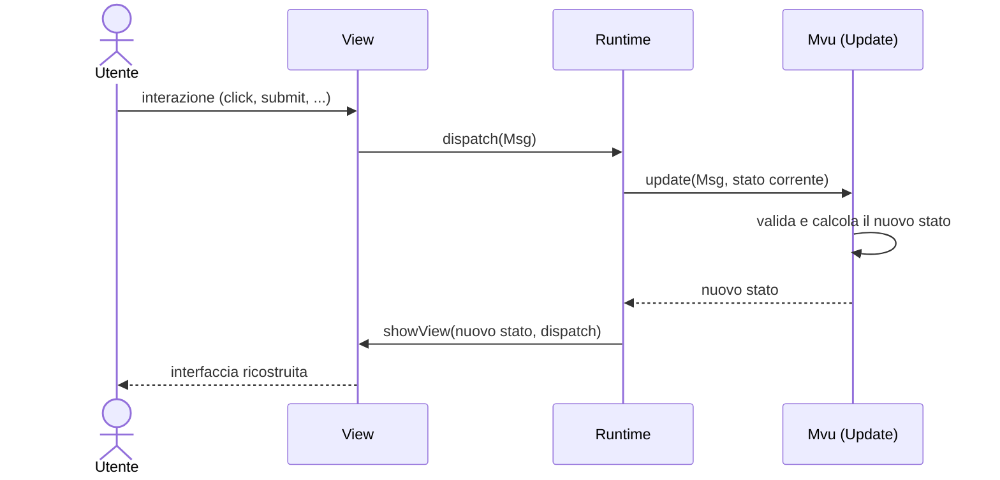
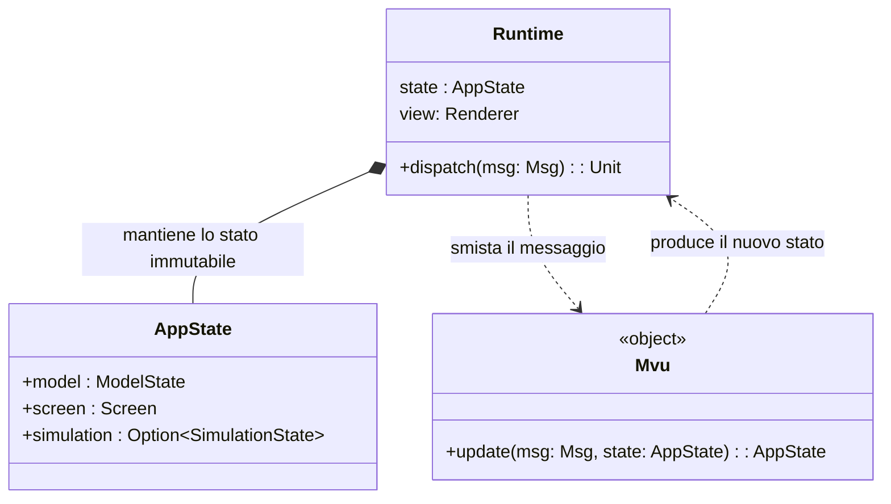
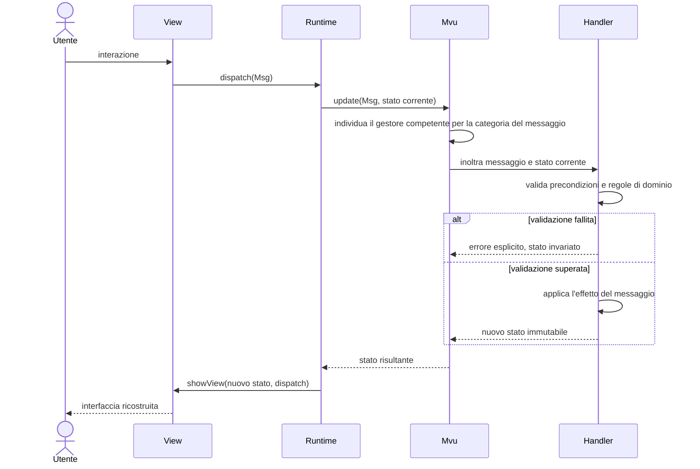
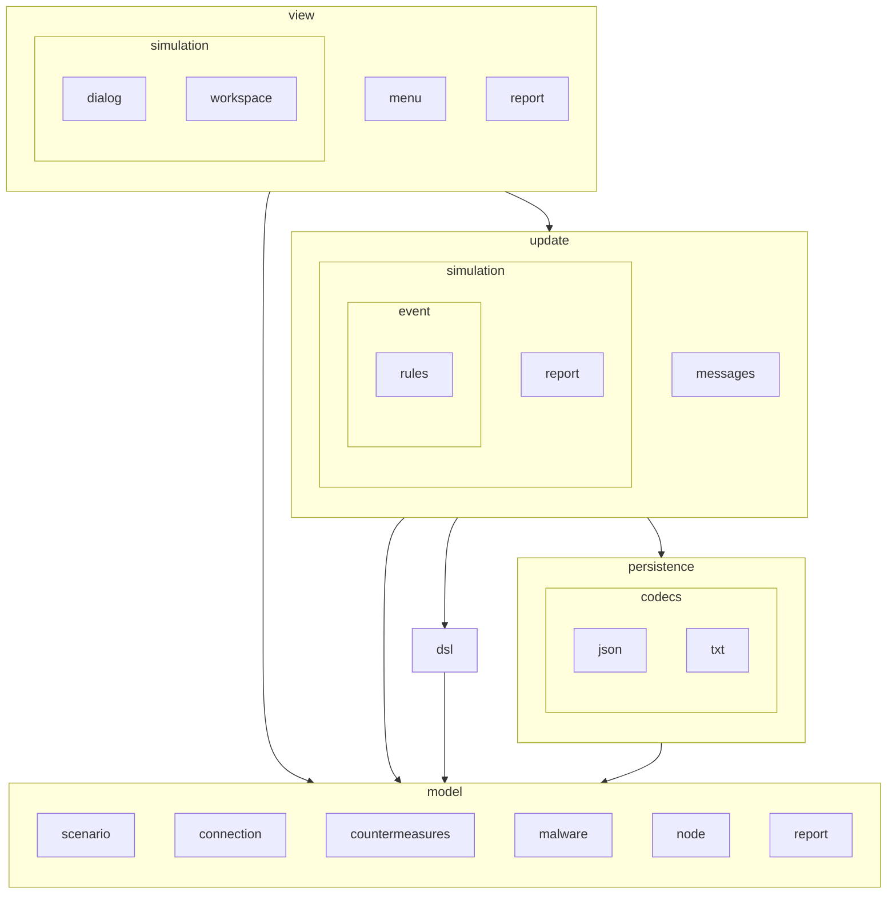

# Design architetturale

Abbiamo deciso di adottare MVU per rispondere alla necessità di gestire uno stato molto complesso, composto da:
- Una topologia di rete,
- L'avanzamento di un' *infezione*,
- Un insieme di contromisure attive. 

Questo ci ha permesso di rendere prevedibile e facilmente testabile la simulazione, senza dover passare per l'interfaccia grafica per verificarne la
correttezza. 

## MVU (Model-View-Update)
Il pattern **MVU**, ha reso possibile gestire l'interfaccia utente tramite un **flusso di dati unidirezionale** e uno **stato applicativo immutabile**, inoltre si sposa alla perfezione con il paradigma funzionale.

Questo approccio ci garantisce due vantaggi cruciali:
* **Prevedibilità:** il comportamento dell'applicazione diventa facile da tracciare e comprendere.
* **Testabilità:** la logica può essere testata in modo isolato, senza la necessità di istanziare o simulare componenti dell'interfaccia grafica.

L'architettura si articola su tre pilastri fondamentali:

1. **Model**:
Rappresenta l'intero stato del sistema concentrato in un'unica struttura dati immutabile.
Gestisce sia lo stato di sessione (schermata attiva, elementi in fase di modifica, indicatori di caricamento, errori di validazione) sia i dati di dominio persistenti.
Non viene mai modificato direttamente, ma viene sostituito integralmente ad ogni transizione di stato.

2. **View**:
Traduce lo stato corrente dell'applicazione negli elementi visuali dell'interfaccia utente, è priva di logica di dominio, si limita a riflettere il `Model` ricevuto. 
Invece di aggiornare puntualmente i singoli controlli grafici, ricostruisce l'albero dei componenti a ogni variazione di stato. Ogni interazione dell'utente viene convertita in un **Messaggio** e inoltrata al sistema, senza quest'ultima debba conoscere l'esito o la gestione dell'evento.

3. **Update**:
Rappresenta l'unico punto dell'applicazione in cui avviene la trasformazione dello stato.
Accetta in ingresso lo **stato corrente** e un **messaggio**, e restituisce il **nuovo stato**.
Concentra dentro di se la logica di aggiornamento dello stato, ed è strutturato come un *dispatcher* che indirizza il messaggio verso handler specializzati in base alla categoria dell'evento.

### Il ciclo in sintesi

1. L'utente interagisce con la **View**.
2. La **View** genera un **Messaggio**.
3. L'**Update** riceve il messaggio e lo stato attuale, producendo un **nuovo Model**.
4. La **View** riceve il nuovo Model e aggiorna lo schermo.

## Organizzazione dello stato (AppState) e del ciclo MVU

Il Model è rappresentato da `AppState`, un'unica struttura dati che distingue lo stato "di
sessione" (cosa l'utente sta facendo in questo momento: schermata attiva, scenario in editing, etc...) dallo stato "di persistenza", isolato in
`ModelState`: le configurazioni salvate in modo persistente e quale di esse è correntemente
aperta. 

Il diagramma seguente modella anche il legame strutturale, complementare alla vista temporale già
vista, tra `Mvu`, `AppState` e `Runtime`, quest'ultimo è l'unico componente che possiede `AppState` 
,`Mvu` non possiede `AppState`, lo riceve e lo restituisce soltanto come
parametro della sua unica funzione, successivamente ne restituisce una copia aggiornata, coerentemente al tipo di messaggio ricevuto.

## Gestione dell'update 

Ogni messaggio in ingresso viene elaborato attraverso tre passi logici distinti, mai in un unico
blocco indistinto: questo isola la decisione di instradamento dalla sua validazione ed esecuzione,
garantendo che lo stesso messaggio applicato allo stesso stato produca sempre lo stesso risultato
e permettendo di testare ogni gestore in isolamento. Nell'implementazione attuale l'instradamento
è realizzato come un passo  separato dagli altri due (un unico smistatore che
copre in modo esaustivo ogni categoria di messaggio); la validazione e l'applicazione avvengono
invece insieme, all'interno della stessa funzione dell'*handler* competente.
Possiamo suddividere nelle 3 seguenti fasi la gestione dell'update:

- **Instradamento**: il messaggio in ingresso viene indirizzato, in base alla categoria a cui
  appartiene (navigazione tra schermate, modifica di una configurazione, ciclo di vita di
  un'elaborazione, importazione/esportazione, ...), verso l'handler responsabile di quella
  categoria l'unico passo realizzato da un componente a sé stante, l' *MVU*.
- **Validazione**: una volta raggiunto l'*handler*, lo stato corrente e i dati del
  messaggio vengono verificati rispetto alle precondizioni e alle regole del dominio; un esito negativo produce un errore esplicito senza alterare lo
  stato.
- **Applicazione**: se la validazione ha esito positivo, lo stesso gestore applica l'effetto del
  messaggio producendo il nuovo stato immutabile, che sostituisce quello corrente e a partire dal
  quale la View ricostruisce la nuova interfaccia.

Il diagramma seguente illustra queste tre fasi per un singolo messaggio, riprendendo e completando
il flusso temporale già visto precedentemente.

## Motivazioni della scelta

Nel nostro sistema l'adozione di questo approccio risponde a esigenze e obiettivi precisi:

- **Gestione dello stato e testabilità**: avere un unico stato immutabile e un'unica funzione di
  transizione permette di testare ogni comportamento del sistema fornendo uno stato e un messaggio
  in input e verificando lo stato prodotto, senza dover avviare l'interfaccia grafica.
- **Aderenza al paradigma funzionale**: lo stato è rappresentato con tipi immutabili e le
  transizioni come funzioni pure che restituiscono un nuovo valore anziché mutare quello
  esistente, in linea con il paradigma di programmazione funzionale adottato nel resto del
  sistema.
- **Centralizzazione della logica di dominio**: ogni regola vive in un unico
  punto, evitando che la stessa logica si disperda tra i vari componenti
  dell'interfaccia.
- **Modularità, KISS, SRP** : l'utilizzo di  *handler*  più piccoli, semplici e specifici al tipo di messaggio, ci 
permette di modificare il comportamento e la logica di validazione e *update* dello stato, limitando l'impatto sugli altri componenti dell'architettura. Riducendo così il debito tecnico e facilitando l'evoluzione del nostro sistema.

L'approccio adottato offre:

- Uno stato sempre ispezionabile e confrontabile, facilmente serializzabile per l'esportazione o il confronto nei test.
- Un flusso dei dati unidirezionale e tracciabile, che semplifica il debugging: ogni cambiamento
  osservato nell'interfaccia è riconducibile a un messaggio preciso e a una singola transizione.
- Un disaccoppiamento netto tra interfaccia e logica di dominio, che rende i due aspetti
  modificabili ed estendibili in modo indipendente, migliorando la manutenibilità del sistema nel
  tempo.

## Struttura dei package

La struttura dei package rispecchia la stessa separazione in sottosistemi appena descritta: il
dominio applicativo (`model`) non dipende da nient'altro, mentre `view`, `update`, `persistence` e
`dsl` lo usano come base comune.

