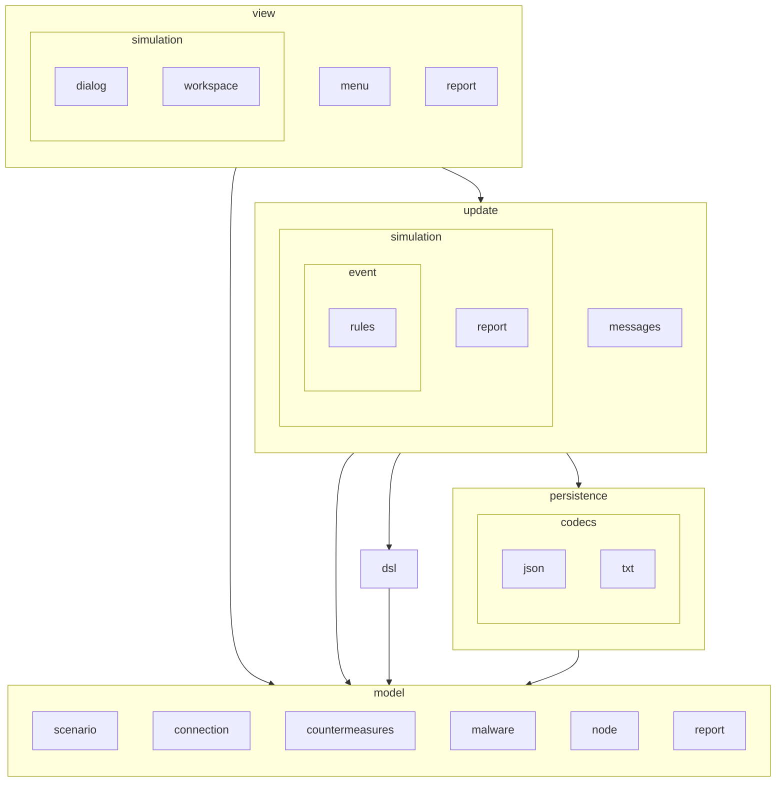
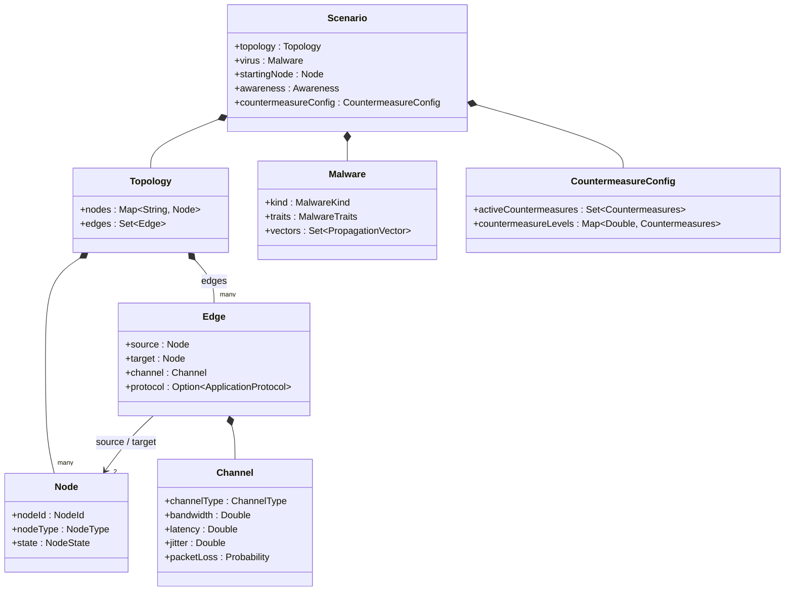
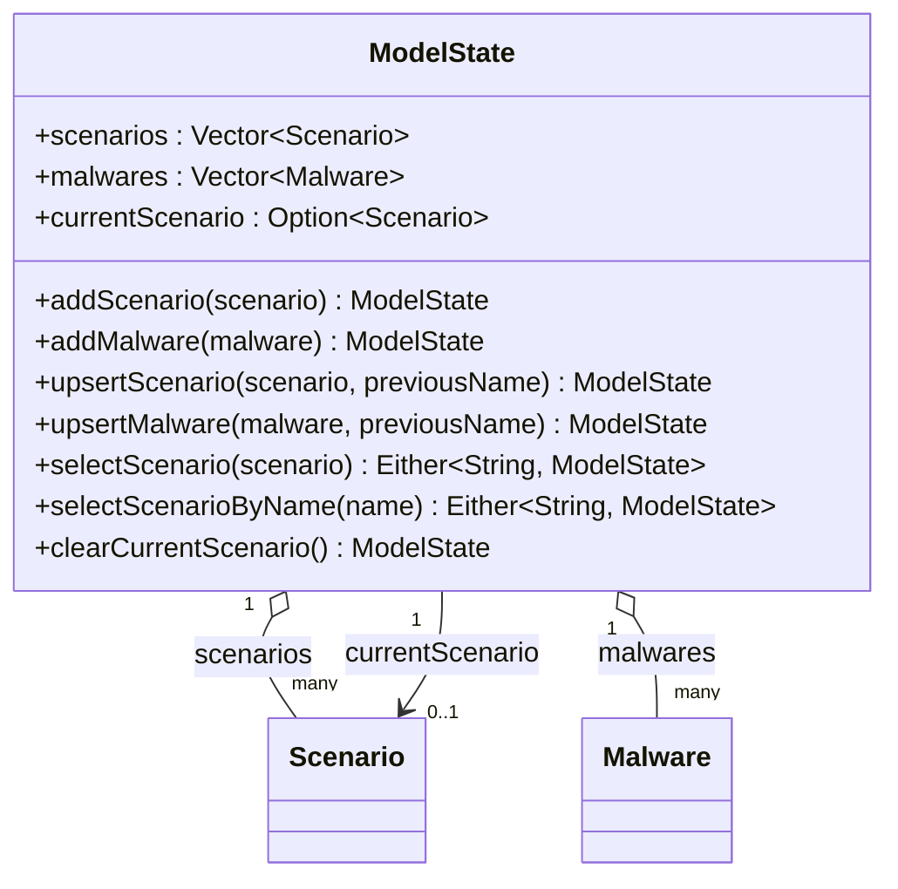
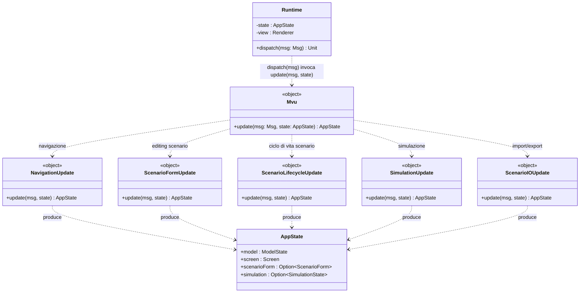
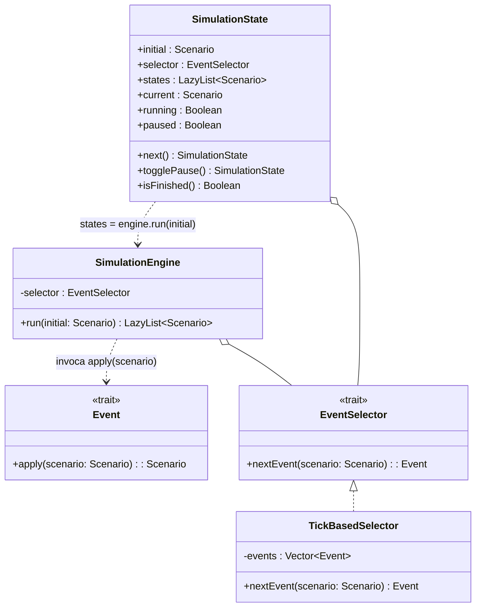
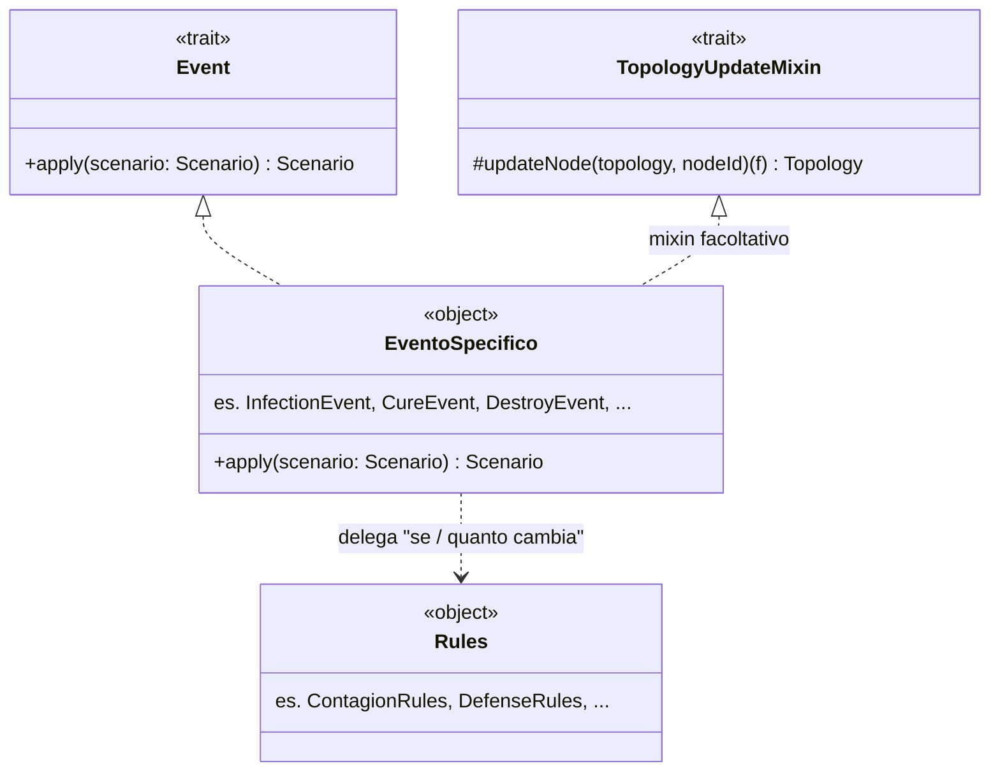
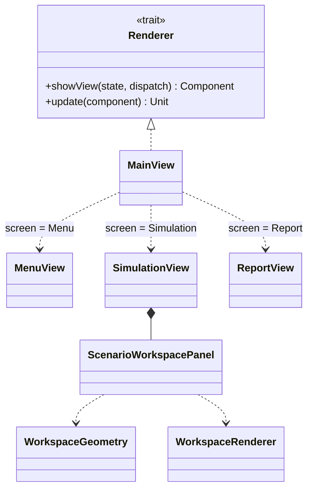

# Design di dettaglio

## Struttura dei package

La struttura dei package rispecchia la stessa separazione in sottosistemi dell'architettura descritta nel capitolo precedente: il
dominio applicativo (`model`) non dipende da nient'altro, mentre `view`, `update`, `persistence` e
`dsl` lo usano come base comune.




## Model
L'obiettivo primario che abbiamo perseguito nelle prime fasi della progettazione è stato quello di realizzare
una modellazione che ci permettesse di rappresentare al meglio le molteplici entità presenti nel nostro dominio,
vista la vastità di quest'ultimo, abbiamo dovuto trovare un equilibrio tra una rappresentazione troppo spicciola del dominio, 
la quale non ci avrebbe permesso di rispettare i requisiti, ed una rappresentazione troppo profonda e specifica, che avrebbe portato ad 
un'esplosione della complessità del sistema.

Al termine della nostra modellazione abbiamo individuato le seguenti entità principali:

**Node** rappresenta un singolo host della rete. Oltre all'identificativo, è descritto dal proprio tipo (`Workstation`, `Server`, `Router`, `IoTDevice`, `MobileDevice`),
ciascuno con una propria vulnerabilità strutturale  che differenziano come il nodo reagisce
all'infezione, lo stato nel ciclo epidemico (`Healthy`, `Infected`, `Quarantined`, `Immune`, `Destroyed`) e
l'insieme dei vettori di propagazione (`vectors`) a cui è esposto.

**Connection** modella un collegamento diretto fra due nodi (`Edge`, con `source`, `target`, un
`channel` e un protocollo applicativo opzionale). Il `Channel` porta banda, latenza, jitter e
probabilità di perdita di pacchetto, e dipende dal tipo di canale (`LAN`, `WAN`, `VPN`); per
ciascun tipo esistono valori di base sovrascrivibili campo per campo, così da
non dover specificare da zero un canale "tipico" ogni volta.

**Malware**: con nome e tipo (`Worm` o
`Virus`, il virus richiede un innesco esplicito per propagarsi,
mentre il worm si diffonde autonomamente), un insieme di caratteristiche (`MalwareTraits`:
infettività, furtività, gravità del payload, persistenza, footprint) e l'insieme dei vettori di
propagazione che sa sfruttare ( `NetworkExploit`, `Phishing`, `Usb`,
`SupplyChain`), è proprio l'intersezione fra i vettori del malware e quelli esposti da un nodo a
determinare se l'infezione può propagarsi lungo una connessione.

**Topology** è il grafo della rete su cui si svolge la simulazione: un insieme di nodi indicizzati
per identificativo e un insieme di archi (`Edge`). Non aggiunge comportamento, 
ma viene arricchita con un blocco di *extension method* che offrono interrogazioni
sul grafo pronte all'uso, usate intensamente dalle regole di simulazione e dalla view per colorare il canvas.

**Scenario**  lega insieme tutte le altre entità in un'unica configurazione, 
inoltre è utilizzato per rappresentare i singoli stati della simulazione: 
la `topology`, il `Malware` che la popola, lo `startingNode` da cui
l'infezione parte, i parametri di avanzamento (`tick`, `seed`, `maxIterations`), il livello di
`awareness` corrente e le `countermeasure` attive. È a questo livello che la validazione
diventa "di insieme": `Scenario` non si limita a controllare i propri campi, ma
verifica anche le relazioni fra loro (ad esempio che `startingNode` appartenga davvero alla
`topology` fornita) prima di poter essere costruito.

Il package `it.unibo.splague.model` contiene esclusivamente dati di dominio puri: nessuna
dipendenza da Swing, da `update` o da `persistence`. Ogni costruttore restituisce
`Either[String, A]` anziché lanciare eccezioni, così un dato invalido non raggiunge mai lo stato
applicativo.




### ModelState

Mentre `Scenario` descrive una singola configurazione, `ModelState` è lo stato *persistente* che
`AppState` tiene distinto da quello di sessione (schermata attiva, form in editing, ...): è la
libreria delle configurazioni salvate, scenari e malware, più il riferimento a quale scenario sia attualmente
correntemente aperto.



## Update

Il package `it.unibo.splague.update` ospita sia il ciclo MVU sia, nel sotto-package
`update.simulation`, il motore di simulazione.


`Mvu.update(msg: Msg, state: AppState): AppState` è il punto unico di smistamento: un singolo
pattern match che raggruppa i casi di `Msg` per categoria (con pattern `|`) e inoltra a uno dei
cinque handler di `update.messages`, ciascuno responsabile di un'unica categoria:

| Handler                    | Categoria                                   | Casi `Msg` gestiti |
|-----------------------------|----------------------------------------------|---------------------|
| `NavigationUpdate`          | Navigazione fra schermate                     | `GoToMenu`, `GoToSimulation`, `GoToReport`, `ImportReport` |
| `ScenarioFormUpdate`        | Modifica dello scenario in editing            | `UpdateScenarioName`, `Add/Update/RemoveNode`, `Add/Update/RemoveEdge`, `AddShape`, `UpdateMalware`, `UpdateAwareness`, `UpdateCountermeasure` |
| `ScenarioLifecycleUpdate`   | Ciclo di vita di uno scenario salvato          | `SelectScenario`, `SaveScenario`, `CancelScenario` |
| `SimulationUpdate`          | Ciclo di vita di un'elaborazione               | `StartSimulation`, `SimulationStep`, `ToggleSimulationPause`, `ResetSimulation` |
| `ScenarioIOUpdate`          | Import/export su file                          | `ExportScenario`, `ImportScenario` |

Ogni handler espone la stessa firma `update(msg: Msg, state: AppState): AppState` e, al suo
interno, applica le fasi di validazione e applicazione descritte nel design architetturale. Alcuni
esempi concreti:

- `ScenarioFormUpdate` incanala quasi tutte le modifiche attraverso un helper privato
  `updateForm(state)(change: ScenarioForm => ScenarioForm)`, che produce un `ValidationError`
  esplicito se nessun form è aperto, altrimenti applica `change` e azzera `state.errors`.
- `SimulationUpdate.StartSimulation` marca il nodo di partenza come infetto (`seedOutbreak`),
  costruisce un `SimulationEngine` con il selettore descritto sotto e salva il `SimulationState`
  risultante, lasciando deliberatamente `model.currentScenario` allo scenario *pre-seed*: è questo a
  permettere a `ResetSimulation` di ripristinare uno scenario pulito, con tutti i nodi `Healthy`.
- `ScenarioIOUpdate` risolve quale `Scenario` esportare con una priorità esplicita:
  `simulation.current` se un'elaborazione esiste, altrimenti `model.currentScenario`, altrimenti la
  conversione dell'eventuale `scenarioForm` aperto.

`Runtime` è lo shell imperativo che chiude il ciclo: possiede l'unico `var state: AppState`, espone
`dispatch(msg)` che chiama `Mvu.update` e ri-renderizza solo se lo stato è cambiato (confronto per
uguaglianza strutturale fra case class), e guida un `javax.swing.Timer` che effettua dispatch
`Msg.SimulationStep` ogni 2500 ms.

Il diagramma seguente riassume staticamente il funzionamento di MVU appena descritto: `Runtime` è
l'unico detentore di `AppState` e l'unico punto che invoca `Mvu.update`; `Mvu` stesso non possiede
stato, riceve `Msg` e `AppState` come semplici parametri e si limita a smistare verso l'handler di
`update.messages` competente per quella categoria, ciascuno dei quali restituisce il nuovo
`AppState` che torna, attraverso `Mvu`, a `Runtime`.



### Il motore di simulazione (`update.simulation`)

`SimulationState` è lo stato di una simulazione: contiene lo scenario iniziale e lo scenario corrente
mostrato a schermo. 

`SimulationEngine` incapsula l'avanzamento puro della simulazione, a ogni iterazione della simulazione applica un `Event` allo scenario corrente,
incrementa `tick` e si ferma quando quest'ultimo raggiunge il massimo di iterazioni configarate dall'utente.

La differenza fra i due è quindi netta: `SimulationEngine` sa *come* calcolare lo stato successivo, `SimulationState`
sa *a che punto* si trova la simulazione e ne espone lo stato.



`EventSelector` decide, dato lo scenario corrente, quale `Event` va applicato nel
prossimo tick. `SimulationEngine` non contiene quindi alcuna
conoscenza di *quali* eventi esistano o in che ordine vadano eseguiti: delega interamente questa
scelta al selettore configurato, limitandosi ad applicarne l'esito.


Le regole di dominio sono incapsulate in sette categorie di `Event`, ciascuna nel proprio file sotto
`update.simulation.event`, quasi tutte appoggiate a logica pura in `event.rules`:

| Evento | Effetto | Regola di supporto |
|---|---|---|
| `Infection.InfectionEvent` | propaga l'infezione ai vicini sani raggiungibili con un vettore compatibile | `ContagionRules.resolveInfection` |
| `Detection` | fa convergere `scenario.awareness` verso un segnale di rilevamento | `AwarenessRules.detectionSignal` |
| `Prevention.DefenseBoostEvent` / `PatchBoostEvent` | rinforza difesa/patch dei nodi sani | `DefenseRules.boostDefense` / `boostPatch` |
| `Cure.CureEvent` / `LowerWorkloadEvent` | guarisce probabilisticamente i nodi infetti/in quarantena, poi ne riduce il workload | `DefenseRules.cureProbability` / `resolveCure` |
| `Destroy.IncreaseWorkloadEvent` / `DestroyEvent` | aumenta il workload degli infetti, poi li distrugge probabilisticamente | `DestructionRules.increaseWorkload` / `resolveDestruction` |
| `CountermeasureActivation.ActivationEvent` | attiva le contromisure la cui soglia di awareness è stata superata | — |
| `Defense.IsolationEvent` / `FirewallEvent` | mette in quarantena / taglia archi secondo le contromisure attive | — |



- **`Event`** — il trait comune a ogni categoria, con l'unico metodo `apply(scenario): Scenario`;
  definisce il contratto "un evento trasforma uno scenario nel successivo", nient'altro.
- **`TopologyUpdateMixin`** — trait opzionale, usato da quasi tutti gli eventi che devono
  modificare uno o più nodi dentro la `Topology`.
  Alcuni eventi (es. `Detection`, `ActivationEvent`) non lo usano perché non toccano
  singoli nodi.
- **Evento specifico** (es. `InfectionEvent`, `CureEvent`, `DestroyEvent`, ...) orchestra "cosa cambia" nello 
  scenario (quali nodi guardare, quale campo
  aggiornare), ma non decide *se* o *quanto* cambia.
- **Rules** (es. `ContagionRules`, `AwarenessRules`, `DefenseRules`, `DestructionRules`) funzioni
  pure a cui l'evento delega proprio la decisione probabilistica o quantitativa, passandogli lo
  stato rilevante; restano così isolate
  e testabili indipendentemente dall'evento che le usa.


## View

Il package `it.unibo.splague.view` implementa l'interfaccia in Scala Swing; è escluso dalla
copertura Scoverage e marcato `// $COVERAGE-OFF$` dove necessario, perché testarlo richiederebbe di
istanziare componenti grafici reali.

Il contratto che disaccoppia `update`/`Runtime` dal framework grafico è `Renderer`:

```scala
trait Renderer:
  def update(component: Component): Unit
  def showView(state: AppState, dispatch: Msg => Unit): Component
```

`MainView` (un `MainFrame`) è l'unica implementazione: tiene un `contentPanel` che sostituisce
interamente a ogni chiamata a `update`, e in `showView` smista su `state.screen` (l'enum `Menu |
Simulation | Report`) verso `MenuView.render`, `SimulationView.render` o `ReportView.render`. Ogni
oggetto-schermata è una funzione pura `render(state, dispatch): Component`: costruisce l'albero di
componenti leggendo `AppState` e chiude su `dispatch` in ogni listener, senza mai mutare lo stato
direttamente.

### Il pattern form-adapter

Swing lavora con testo (`TextField`), mentre il dominio usa tipi specifici (`Int`, `Double`, `ADT`). Per questo ogni aggregato/entità rilevante ha un "form" gemello in `view.form` (`ScenarioForm`,
`NodeForm`, `EdgeForm`, `ChannelForm`, `MalwareForm`, `AwarenessForm`, `CountermeasureForm`) con
campi numerici rappresentati come `String` e due conversioni simmetriche: `fromX(domain): Form`
(sempre valida, per popolare i campi) e `toDomain(form): Either[String, Domain]` (valida e fa il
parsing). `ScenarioForm` è il caso rappresentativo, perché compone ricorsivamente gli altri form:

```scala
def toDomain(form: ScenarioForm): Either[String, Scenario] =
  for
    topology     <- TopologyForm.toDomain(form.topology)
    malware      <- MalwareForm.toDomain(form.virus)
    startingId   <- NodeId.of(form.startingNodeId)
    startingNode <- topology.nodes.get(startingId.value)
                      .toRight(s"Starting node '${form.startingNodeId}' not found in topology")
    tick         <- parseInt(form.tick, "tick")
    seed         <- parseInt(form.seed, "seed")
    maxIterations<- parseInt(form.maxIterations, "maxIterations")
    awareness    <- Awareness(form.awareness)
    counter      <- CountermeasureForm.toDomain(form.countermeasureConfig)
    scenario     <- Scenario(form.name, topology, malware, startingNode, tick, seed,
                              maxIterations, awareness, counter)
  yield scenario
```

Le utilità di parsing condivise (`FormParsing.parseDouble`, `parseInt`, `parseProbability`, oltre a
helper come `foldEither` e `checkDuplicateNodeIds`) restituiscono sempre un `Either[String, A]` con
un messaggio che nomina il campo in errore, in modo che ogni form possa comporre le proprie
validazioni con la stessa `for`-comprehension vista sopra.

### Lo screen `Simulation`

`SimulationView` è lo screen più complesso: a differenza delle altre viste, non ricostruisce tutto
da zero a ogni render. Mantiene una `Session` (canvas, dialog di configurazione, bottoni, label)
cache a livello di modulo fra una chiamata e l'altra; se una `Session` esiste già, il render si
limita a richiamare `session.update(...)` per risincronizzare testo/enabled dei widget con il nuovo
`AppState`, invece di ricostruire l'albero Swing — l'unica eccezione deliberata alla regola generale
"ricostruisci tutto a ogni render", giustificata dal costo di ricreare un canvas interattivo e dei
dialog modali a ogni tick di simulazione.

`ScenarioWorkspacePanel` è il canvas: un `scala.swing.Component` che possiede uno stato
*esclusivamente di vista* (zoom, offset di pan, nodo/edge selezionato, spostamento di component, ...) che non
entra mai in `AppState`. Gestione di mouse/tastiera e conversione in `Msg` (`AddNode`, `UpdateNode`,
`RemoveNode`, `AddEdge`, `RemoveEdge`, apertura dei dialog editor) restano qui; sono invece delegate
a due oggetti puri, privi di stato proprio:

- `WorkspaceGeometry`, conversioni schermo↔modello e hit-testing (`screenToModel`, `pickNode`,
  `pickEdge`, `connectionExists`).
- `WorkspaceRenderer`, disegno vero e proprio su `Graphics2D` (nodi colorati per `NodeState`,
  archi con freccia direzionale).



